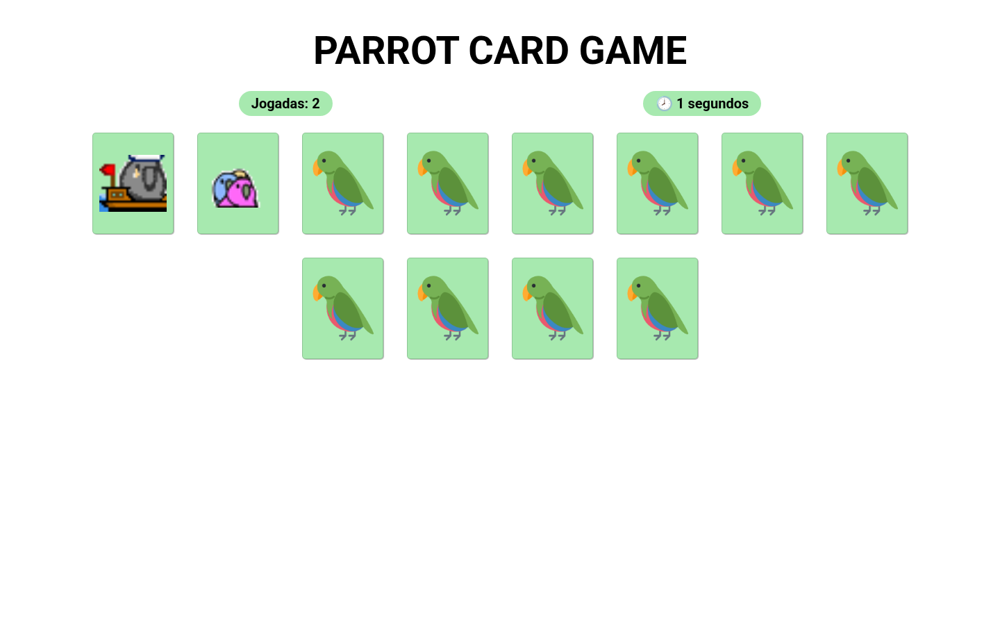
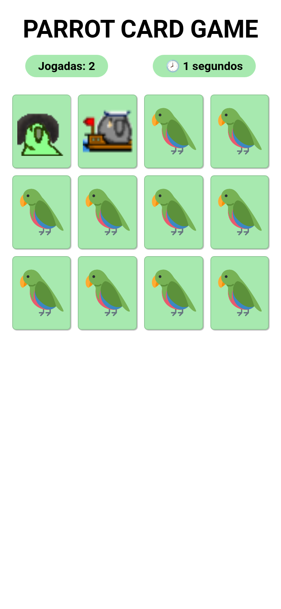

# 🦜 Parrot Card Game

A memory card game built with vanilla HTML, CSS and JavaScript. Pick an even number of cards (4–14), flip them two at a time and find all the matching parrot pairs while the game tracks your moves (*jogadas*) and elapsed time.

Originally developed in [ManuDiasCruz/parrots-memory-card-game](https://github.com/ManuDiasCruz/parrots-memory-card-game); this branch adds mobile responsiveness and the updated color palette requested by the client.

| Desktop | Mobile (390px) |
|---|---|
|  |  |

## How to play

1. When the page loads, type how many cards you want to play with (an even number between 4 and 14).
2. Tap/click a card to flip it, then flip a second one.
3. If the two cards match they stay open; otherwise they flip back after one second.
4. Match every pair to win — the game reports how many moves you took and offers a new round.

## Running locally

No build step or dependencies are required.

```bash
git clone https://github.com/ManuDiasCruz/ai-training-workspace-may.git
cd ai-training-workspace-may
git checkout fable-parrot-memo-game
```

Then either open `index.html` directly in a browser, or serve the folder (recommended):

```bash
python3 -m http.server 8000
# or: npx serve .
```

and visit <http://localhost:8000>.

## UI & responsiveness improvements

This branch reworks the presentation layer; game logic is unchanged.

**Responsive layout (320px phones → desktop):**

- Replaced the fixed `116px` page margins with a centered max-width container, so the board no longer collapses into a single squeezed column on phones.
- Cards now size fluidly — `clamp(64px, 21vw, 117px)` with a locked `117/146` aspect ratio — giving 4 cards per row on phones and up to 8 on desktop, with no horizontal overflow at any width and the whole board visible for memorization.
- Card spacing uses flex `gap` instead of asymmetric margins, and card faces/artwork scale with the card (`object-fit: contain`) instead of being hardcoded to `100×100px`.
- Title, counters and the end-of-game message scale with `clamp()`.
- Touch polish: `touch-action: manipulation`, no tap highlight or accidental text selection, pointer cursor on cards.

**Color palette (client request — white, light green, black font):**

| Role | Color |
|---|---|
| Page background | White `#FFFFFF` |
| Cards, card faces, counter pills | Light green `#A7E9AF` |
| All text | Black `#000000` |

The palette is defined as CSS custom properties in `:root` (`css/style.css`). Card artwork (the parrot GIFs) is game content and keeps its original colors.

**Small fixes along the way:**

- `css\style.css` → `css/style.css` (backslash URL broke outside Windows-style handling).
- Removed a stray `print()` debug call that opened the browser's print dialog when an invalid card count was entered.
- Move and time counters render immediately on load instead of starting blank.
- Added a favicon (no more 404) and trimmed the Google Fonts request to the Roboto weights actually used.

## Known limitations

- Game setup and the end-of-game flow use native `prompt()`/`alert()` dialogs — functional on mobile but dated; an in-page start screen and result modal would be the natural next step.
- The timer starts when the page loads (not at the first move) and keeps counting after a finished game, as in the original.
- UI text is in Portuguese, matching the original project.
- The board screenshots in `screenshots/` are static captures; the card art is animated GIFs in the running game.
