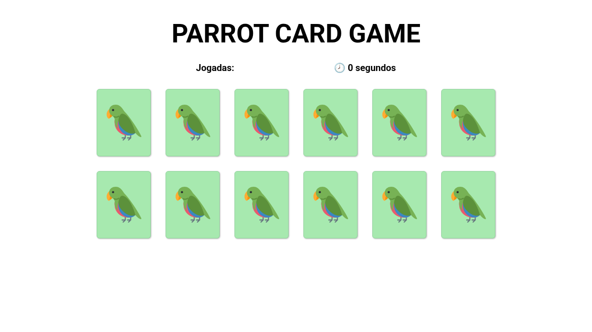
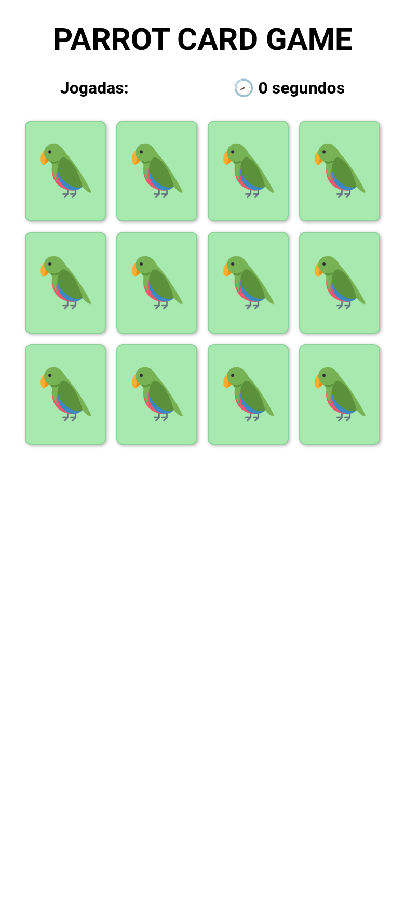

# Workspace projects

## Sing Me a Song — branch `0827-ben-singasong`

The repaired full-stack project is in [sing-me-a-song](sing-me-a-song/README.md).
See that README for setup, environment variables, validation, deployment, and known limitations.
The original workspace project and its documentation are preserved below.

---

# 🦜 Parrot Memory Card Game

A small browser memory game: flip the cards two at a time and find every
matching pair of parrots in as few moves as possible. Built with plain
**HTML, CSS and JavaScript** — no build step and no dependencies.



## How to play

1. On load you're asked **how many cards** to play with — an even number
   between **4 and 14**.
2. Click a card to flip it, then flip a second card:
   - if the two match, they stay revealed;
   - if not, they flip back after a moment.
3. The header tracks your number of moves (**Jogadas**) and the elapsed time
   (**relógio**).
4. Match every pair to win — you can then start a new game.

> ℹ️ The in-game text is in Brazilian Portuguese (the original author's language).

## Project structure

```text
.
├── index.html        # markup, meta tags and asset links
├── css/
│   └── style.css     # colour palette + responsive layout
├── src/
│   └── script.js     # game logic (shuffle, flip, match, timer)
└── img/              # parrot artwork + preview screenshots
```

## Running locally

This is a static site, so all you need is a browser.

**Option A — open directly**

Double-click `index.html`, or open it in your browser.

**Option B — local server (recommended)**

A tiny static server avoids any path/caching quirks:

```bash
# from the project root
python3 -m http.server 8000
# then open http://localhost:8000/ in your browser
```

Any static server works (`npx serve`, the VS Code *Live Server* extension,
etc.). An internet connection is used only to load the Google Fonts.

## UI / responsiveness improvements

This round of work delivered the client's two requests — a mobile-friendly
layout and a **white / light-green / black** colour scheme — plus a few small
correctness fixes.

### Colour palette

Colours are centralised as CSS variables in `css/style.css`:

| Token             | Value     | Use                                            |
| ----------------- | --------- | ---------------------------------------------- |
| `--color-bg`      | `#ffffff` | page background (was pale-lime `#EEF9BF`)      |
| `--color-surface` | `#a7e9af` | cards / faces — light green                    |
| `--color-border`  | `#8ed29a` | card edges — same green family                 |
| `--color-text`    | `#000000` | all text (was teal `#75B79E` and gray)         |

The old teal title, lime background and gray counters are gone — the UI now
uses only white, light green and a black font, as requested.

### Responsiveness

- `box-sizing: border-box` applied globally.
- Replaced the fixed `main { margin: auto 116px }` with a centred max-width
  container and fluid `clamp()` padding.
- Cards now size with `clamp()` widths + `aspect-ratio: 117/146` and lay out
  using `gap`, so they **scale and wrap on any screen** instead of overflowing.
- Fluid `clamp()` typography for the title, header counters and end message.
- Removed the lone `@media (max-width: 335px)` rule — it left typical phones
  (~360–430px) stuck on the desktop layout. The fluid system now covers
  everything from small phones to large desktops.
- `@media (hover: hover)` card-lift effect, so touch devices don't get
  "sticky" hover states.

Verified at **1280px** (desktop), **390px** and **360px** (mobile):

| Desktop                     | Mobile                    |
| --------------------------- | ------------------------- |
|  |  |

### Small fixes

- `index.html` linked `css\style.css` with a backslash; corrected to
  `css/style.css` (browsers tolerate it, but stricter static servers 404).
- Removed a stray `print(...)` debug call in `script.js` that resolved to
  `window.print()` and opened the browser print dialog on invalid input.
- Added an inline parrot-emoji favicon (removes the `/favicon.ico` 404) and a
  `theme-color` meta tag matching the palette.

## Known limitations & future improvements

- **Card count via `prompt()`** — the game still asks for the number of cards
  through a native `prompt()` on load. It works on mobile, but an in-page
  start screen / selector would be friendlier. Left as-is to keep the change
  scoped to the requested UI work.
- **Parrot artwork is intentionally unchanged** — the colourful parrot images
  are game *content*, so the white/light-green/black palette applies to the UI
  chrome, not the artwork.
- **Win / replay dialogs** use native `alert()` / `prompt()`; these could
  become styled in-page modals.
- **No persistence** — moves and elapsed time reset on every reload; there is
  no high-score / best-time tracking.
- **UI copy is Portuguese only** — no internationalisation yet.

## Credits

Original game by
[@ManuDiasCruz](https://github.com/ManuDiasCruz/parrots-memory-card-game).
Parrot GIFs come from the community "Party Parrot" set. This branch adds the
responsive layout and the white/light-green/black palette.
