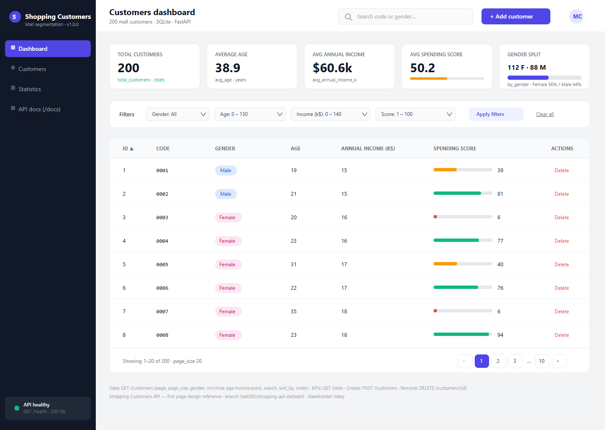

# Shopping Customers API

A small production-style REST API built on top of the
[Mall Customer Segmentation dataset](https://www.kaggle.com/datasets/vjchoudhary7/customer-segmentation-tutorial-in-python).
Records are imported from `data/Shopping_data.csv` into a local SQLite
database and exposed through a FastAPI service.

## Project description

The project demonstrates a small, fully runnable backend for an analytics
dataset:

- **Source data:** 200 mall customers with `CustomerID`, `Genre` (gender),
  `Age`, `Annual Income (k$)` and `Spending Score (1-100)`.
- **Storage:** SQLite, managed through SQLAlchemy 2.x ORM, with sensible
  `CHECK` constraints and indexes.
- **API:** FastAPI with Pydantic v2 schemas, pagination, filtering,
  search, sorting and basic write operations.
- **Tests:** pytest + `TestClient` running against an isolated SQLite
  file per test run.

## Design

**Stakeholder: Mary**

### Penpot prototype — Customers Dashboard (first page)



- **Prototype link (Penpot file):**
  [`docs/design/penpot/shopping-customers-dashboard.penpot`](docs/design/penpot/shopping-customers-dashboard.penpot)
  — open [Penpot](https://design.penpot.app), go to *Drafts → Import file* and select
  the `.penpot` file to load the full editable design (board, layers, and the
  color tokens in the file library).
- **Also in this repo:**
  [SVG canvas](docs/design/penpot/shopping-customers-dashboard.svg) (pixel-exact,
  viewable in the browser and importable into Penpot as vector shapes),
  [PNG preview](docs/design/penpot/dashboard-preview.png), and the
  [generator script](docs/design/penpot/build-dashboard.mjs) that builds the
  `.penpot` file with [`@penpot/library`](https://www.npmjs.com/package/@penpot/library).
- **Application branch this design targets:**
  [`task002/shopping-api-dataset3`](https://github.com/ManuDiasCruz/ai-training-workspace-may/tree/task002/shopping-api-dataset3)
  (this Shopping Customers API).
- **Scope:** first page only — the **Customers Dashboard**.

### What the page contains

1. **Sidebar** — product identity, navigation (Dashboard active), and an
   API-health card wired to `GET /health`.
2. **Top bar** — page title, global search (`GET /customers?search=`), and the
   primary **"+ Add customer"** button (`POST /customers`).
3. **KPI stat tiles** — driven by `GET /stats`: total customers (200), average
   age (38.9), average annual income ($60.6k), average spending score (50.2,
   with meter), and the gender split (112 F / 88 M, with ratio bar).
4. **Filter bar** — maps 1:1 to `GET /customers` query params: `gender`,
   `min_age`/`max_age`, `min_income`/`max_income`, `min_score`/`max_score`.
5. **Customers table** — real records 1–8 from the dataset; columns: ID,
   customer code, gender chip, age, annual income (k$), spending score with a
   colored meter (≥70 emerald, 30–69 amber, <30 red), and a delete row action
   (`DELETE /customers/{id}`). Sortable headers map to `sort_by` + `order`.
6. **Pagination footer** — `page` / `page_size` (default 20), "Showing 1–20 of
   200".

### Notes for the frontend team

- **Endpoints for this page:** just `GET /stats` and `GET /customers` (plus
  `POST /customers` / `DELETE /customers/{id}` for the two actions). Run the
  API locally with `python -m scripts.import_data` then
  `python -m uvicorn app.main:app --reload --port 8000` (Swagger at `/docs`).
- Debounce the search input; apply range filters on commit (Apply button), not
  per keystroke.
- Error handling: `400` for inconsistent ranges (e.g. `min_age > max_age`) and
  `422` for invalid values → show inline on the filter bar; `409` on create is
  a duplicate `customer_code` → field-level error; `404` on delete → row
  already gone.
- Include loading skeletons for tiles/table and an empty "no results for these
  filters" state that keeps filter chips visible.
- **Design tokens:** colors are registered in the Penpot file library
  (Primary/Indigo 600 `#4F46E5`, Ink/Gray 900 `#111827`, Muted/Gray 500
  `#6B7280`, Line/Gray 200 `#E5E7EB`, Canvas/Gray 100 `#F3F4F6`,
  Accent/Amber 500 `#F59E0B`, Success/Emerald 500 `#10B981`, Danger/Red 500
  `#EF4444`). Type: Source Sans Pro; 4px spacing grid; radius 8 (controls) /
  12 (cards).
- A second board on the same page, **"Hand-off notes"**, summarizes the
  API-to-widget mapping for quick reference inside Penpot.

## Database design

Single table `customers` (one row per customer).

| Column            | Type        | Notes                                            |
|-------------------|-------------|--------------------------------------------------|
| `id`              | INTEGER PK  | Auto-increment surrogate key.                    |
| `customer_code`   | VARCHAR(8)  | Unique, indexed — original `CustomerID` (`0001`).|
| `gender`          | VARCHAR(16) | `Male` or `Female` (source column `Genre`).      |
| `age`             | INTEGER     | `CHECK age BETWEEN 0 AND 130`.                   |
| `annual_income_k` | INTEGER     | Annual income in thousands of dollars (`>= 0`).  |
| `spending_score`  | INTEGER     | `CHECK spending_score BETWEEN 1 AND 100`.        |

Additional indexes: `ix_customers_customer_code` (unique) and a composite
`ix_customers_gender_age` to speed up the most common filter combination.

### Why a single table?

The dataset is a flat survey/segmentation snapshot — there are no
relationships, transactions or time series. A single normalized table
captures the data faithfully without over-engineering. The schema is
written so a future order/transaction table could reference
`customers.id` as a foreign key.

## Project layout

```
.
├── app/
│   ├── __init__.py
│   ├── crud.py          # Query helpers
│   ├── database.py      # SQLAlchemy engine / session
│   ├── main.py          # FastAPI app and routes
│   ├── models.py        # ORM models
│   └── schemas.py       # Pydantic request / response models
├── data/
│   └── Shopping_data.csv
├── scripts/
│   └── import_data.py   # CSV → SQLite importer
├── tests/
│   ├── conftest.py
│   └── test_api.py
├── requirements.txt
└── README.md
```

## Setup

Requires Python 3.10+ (tested on 3.11).

```bash
python -m venv .venv
source .venv/bin/activate
pip install -r requirements.txt
```

## Execution

Import the dataset into a local SQLite database (`shopping.db` in the
repo root, created on first run):

```bash
python -m scripts.import_data
```

Run the API:

```bash
python -m uvicorn app.main:app --reload --port 8000
```

Then visit:

- Swagger UI: <http://127.0.0.1:8000/docs>
- ReDoc:      <http://127.0.0.1:8000/redoc>
- Health:     <http://127.0.0.1:8000/health>

Run the test suite:

```bash
python -m pytest -q
```

The `DATABASE_URL` environment variable overrides the SQLite location,
e.g. `DATABASE_URL=sqlite:////tmp/shopping.db`.

## API usage examples

### List customers with pagination

```bash
curl "http://127.0.0.1:8000/customers?page=1&page_size=5"
```

### Filter

```bash
# Female customers aged 18–25, top spending scores first
curl "http://127.0.0.1:8000/customers?gender=Female&min_age=18&max_age=25&sort_by=spending_score&order=desc&page_size=5"

# High-income customers
curl "http://127.0.0.1:8000/customers?min_income=100"
```

Supported filters: `gender`, `min_age`, `max_age`, `min_income`,
`max_income`, `min_score`, `max_score`.
Sortable columns: `id`, `age`, `annual_income_k`, `spending_score`,
`customer_code`. Order: `asc` (default) or `desc`.

### Search

`search` does a case-insensitive substring match on `customer_code` and
`gender`:

```bash
curl "http://127.0.0.1:8000/customers?search=0042"
```

### Single customer

```bash
curl "http://127.0.0.1:8000/customers/1"
```

### Dataset statistics

```bash
curl "http://127.0.0.1:8000/stats"
```

Returns total count, gender breakdown and averages.

### Create / delete

```bash
curl -X POST "http://127.0.0.1:8000/customers" \
     -H "Content-Type: application/json" \
     -d '{"customer_code":"9999","gender":"Female","age":28,"annual_income_k":60,"spending_score":55}'

curl -X DELETE "http://127.0.0.1:8000/customers/201"
```

## Endpoints summary

| Method | Path                  | Description                                |
|--------|-----------------------|--------------------------------------------|
| GET    | `/health`             | Liveness probe.                            |
| GET    | `/stats`              | Dataset aggregate statistics.              |
| GET    | `/customers`          | Paginated, filterable, searchable list.    |
| GET    | `/customers/{id}`     | Fetch a single customer by surrogate id.   |
| POST   | `/customers`          | Create a new customer.                     |
| DELETE | `/customers/{id}`     | Delete a customer.                         |

## Validation & error handling

- Request bodies and query parameters are validated by Pydantic; invalid
  input returns HTTP `422` with a structured detail payload.
- Inconsistent range filters (`min_age > max_age`, etc.) return HTTP
  `400`.
- Missing resources return HTTP `404` with `{"detail": "..."}`.
- Duplicate `customer_code` on create returns HTTP `409`.

## Known limitations & future improvements

- **Auth:** the API is fully open. A real deployment needs API keys or
  OAuth/JWT.
- **No update endpoint.** Only create / read / delete are exposed.
- **SQLite only.** Fine locally; for production swap in Postgres via
  `DATABASE_URL` and add Alembic migrations.
- **Search is intentionally simple** (`LIKE` over a couple of columns).
  Full-text search would need FTS5 or an external index.
- **No rate limiting / observability.** Logging, metrics and request
  tracing are out of scope for this exercise.
- **Tiny dataset.** All 200 rows fit in memory; the design choices would
  differ for millions of records (server-side cursor pagination,
  caching, etc.).
