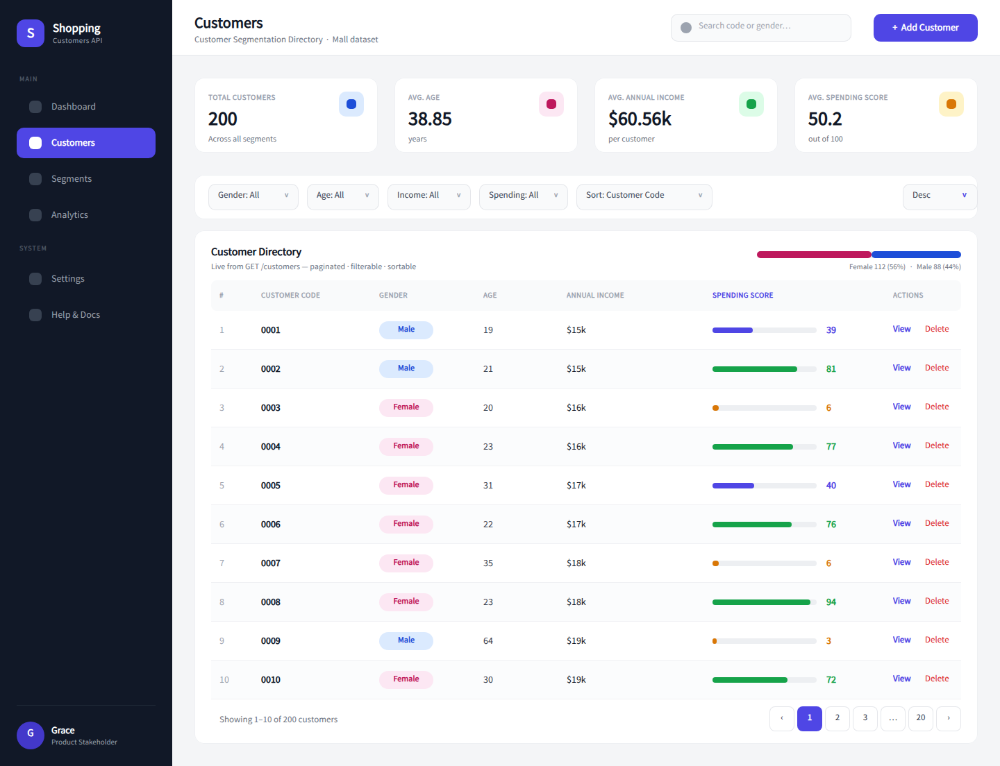

# Design — Customer Directory (First Page)

**Stakeholder: Grace**

Developer-ready UI/UX reference for the **first page** of a frontend on top of
the [Shopping Customers API](../../../README.md). The design is a
**Customer Directory / segmentation dashboard** mapped 1:1 to the existing
FastAPI endpoints — no new backend work is required to build it.

## Links

- **Penpot prototype (view-only, no account needed):**
  <https://design.penpot.app/#/view/e35751e0-8829-45c8-a191-ab5fcd6565ff?page-id=f0485fb1-4e63-8165-8008-38abbef6c0a5&share-id=f0485fb1-4e63-8165-8008-38acfc2c729a&index=0>
- **Static preview:** [`preview.png`](preview.png)
- **Developer handoff & API mapping:** [`implementation-spec.md`](implementation-spec.md)
- **Design tokens:** [`design-tokens.json`](design-tokens.json)
- **Related app branch:** [`task002/shopping-api-dataset3`](https://github.com/ManuDiasCruz/ai-training-workspace-may/tree/task002/shopping-api-dataset3)

## What's on the page

| Block | Bound to | Highlights |
|-------|----------|-----------|
| KPI strip | `GET /stats` | Total customers (200), avg age (38.85), avg income ($60.56k), avg spending (50.2) |
| Filter toolbar | `GET /customers` params | gender, age, income, spending ranges; sort + order |
| Customer table | `GET /customers` → `items` | gender badges, `$k` income, color-banded spending-score bars, View/Delete |
| Gender split bar | `GET /stats.by_gender` | Female 112 (56%) · Male 88 (44%) |
| Pagination | `page` / `page_size` | "Showing 1–10 of 200" |

## Approach / customization

This reference follows a conventional, free/public SaaS **admin-dashboard**
pattern as the starting frame, then adapts it specifically to this repository:

- the dataset's **real fields** (`customer_code`, `gender`, `age`,
  `annual_income_k`, `spending_score`) and **real sample rows** from
  `data/Shopping_data.csv`;
- the service's **exact** filters, sort keys and pagination;
- score-band indicators and gender badges tuned to the data ranges;
- an indigo/navy palette and Source Sans Pro type scale captured as tokens.

Scope is intentionally limited to the **first page** requested for this sprint.
See [`implementation-spec.md`](implementation-spec.md) for the full
component-by-component API binding, states (loading/empty/error/validation) and
build notes.
