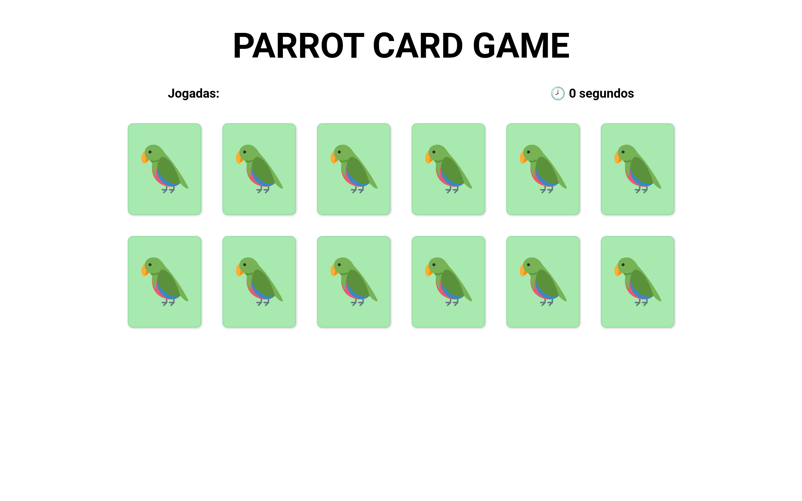
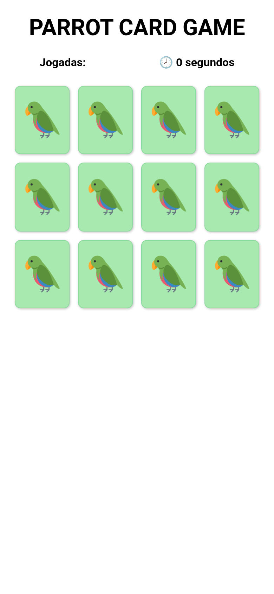

# 🦜 Parrot Memory Card Game

A small browser-based memory (concentration) game. The board is filled with
pairs of parrot cards face down; flip two at a time and find every matching
pair in as few moves as possible. A move counter and an elapsed-time clock
track your progress, and a win message appears once all pairs are matched.

> Originally created at
> [ManuDiasCruz/parrots-memory-card-game](https://github.com/ManuDiasCruz/parrots-memory-card-game).
> This version adds mobile responsiveness and an updated color scheme.




## Project overview

- **Stack:** plain HTML, CSS and vanilla JavaScript — no build step or
  dependencies.
- **Structure:**
  - `index.html` — page markup and the game container.
  - `css/style.css` — all styling, colors (as CSS custom properties) and the
    responsive layout.
  - `src/script.js` — game logic: card generation, shuffling
    (Fisher–Yates), flip handling, match validation, move counter and timer.
  - `img/` — the parrot card images (card back + the animated parrot faces).
  - `docs/` — UI screenshots used in this README.
- **How to play:** when the page loads you are asked how many cards to play
  with (an even number between 4 and 14). The cards are shuffled and dealt
  face down; click any two to reveal them. Matching pairs stay face up,
  non-matching pairs flip back. Match every pair to win.

## Local setup

No installation or build is required — it is a static site. Because the game
loads images and a script with relative paths, serve it over a local HTTP
server rather than opening the file directly.

```bash
# Clone and enter the project
git clone https://github.com/ManuDiasCruz/ai-training-workspace-may.git
cd ai-training-workspace-may/parrots-memory-card-game

# Start any static server, e.g. Python's built-in one:
python3 -m http.server 8000
```

Then open <http://localhost:8000> in your browser. Any equivalent static
server works too, for example:

```bash
npx serve .        # Node
php -S localhost:8000   # PHP
```

## UI / responsiveness improvements

This version focuses on responsiveness and a consistent color scheme:

**Color scheme (white / light green / black):**

- Page background changed from yellow-green (`#EEF9BF`) to **white**.
- All text — title, move counter and timer — is now **black** (previously
  teal `#75B79E` and gray).
- Cards and card faces use a consistent **light green**.
- All colors are centralized as CSS custom properties (`:root`) so the palette
  is applied consistently across the UI and is easy to adjust.

**Mobile responsiveness:**

- The card board is now a fluid flex grid: cards wrap automatically and the
  spacing scales with the viewport (`gap` + `clamp()`), instead of fixed
  pixel margins.
- Card size is fluid (`width: clamp(72px, 20vw, 117px)`) and uses
  `aspect-ratio` to keep the original 117:146 proportions on every screen.
- Card faces fill the card and the parrot images scale relative to it, so the
  flip animation looks correct at any size.
- Title, navigation bar and text scale fluidly with `clamp()`; the nav wraps
  gracefully on narrow screens.
- The container is width-capped and centered with fluid side padding so it
  never overflows small viewports.
- The old single-column `max-width: 335px` rule was replaced with a sensible
  small-phone tweak (`max-width: 380px`).

Verified at desktop (1280px), typical mobile (390px) and very narrow (320px)
widths, with the card-flip interaction working at every size.

## Known limitations / future improvements

- **Game start uses `prompt()`/`alert()`:** the number of cards is requested
  via a native `prompt()` and the win message uses `alert()`. These are
  blocking and not styleable; replacing them with an in-page menu/modal would
  improve UX and accessibility.
- **UI text is in Portuguese** (e.g. "Jogadas", "segundos"); it is not yet
  internationalized.
- **No persistence:** scores, best times and move counts are not saved between
  sessions.
- **Card backs are not hidden from inspection:** as a static client-side game,
  the layout can be read from the DOM/devtools.
- **Accessibility:** cards are clickable `div`s without keyboard navigation or
  ARIA roles; adding keyboard support and labels would help.
